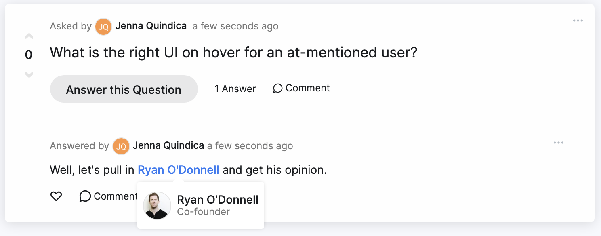

# Cleary Take-Home Project
The goal of this Ruby on Rails & React take-home project is to assess your ability to take a full-stack feature and see it through to completion. We recommend prioritizing functionality and readability over polish.

This repository mocks our Events product, where teams can solicit and answer questions asynchronously before a meeting. We've setup Events, Questions, and Answers for you. Something our users do often is at-mention others in their answers. Example: "This is a great question. @Thomas can speak to this on Monday." Your primary task with this take-home project is to implement at-mention functionality for answers.

## Before You Start
Screencasts are a core component of the software development lifecycle at Cleary.

Before you start, watch this [screencast](https://www.loom.com/share/f488c7b4fe2344a5a5bb98594a95a843). It demos the at-mention functionality in Cleary and gives a taste of what we're looking for.

## Required User Stories
*Estimated time to completion: 3-4 hours*

#### As someone answering a question, I want to mention someone in my answer.
##### Requirements
- [ ] When mentioning someone in an answer, I want the "@" symbol to trigger a search over users and show me the top three user results based on the characters after the "@" symbol.
- [ ] As someone reading an answer, I want to see the mentioned person's job title when I hover over their name. It should basically look like the screenshot below without the photo. 
- [ ] When I have been mentioned in a question or answer, I want to receive an email notification that I have been mentioned with a link to the question.
- [ ] Record your own screencast using Loom to demo your take-home project and walk through the code.

**Hint:** We use the [Tribute.js library](https://froala.com/wysiwyg-editor/examples/tribute-js/) for at-mentions in our own Froala integration.

##### Stretch
If you have extra time, you can complete these stretch goals.

- [ ] I want to at-mention users in questions.
- [ ] Document the features you'd like to tackle next if given the time (or if you joined us at Cleary!).

## Instructions
##### Installation
`bundle install`

`yarn install`

`bundle exec rails db:setup`

##### Running the App
`bundle exec rails server`

`./bin/webpack-dev-server`

## Asking for Help
You can reach out to Jenna or Ryan at [first name]@gocleary.com for any questions about this take-home project. We encourage you to ask for help if you're blocked or are unsure about requirements, but consider time-boxing your troubleshooting to 20 minutes before reaching out to us.
